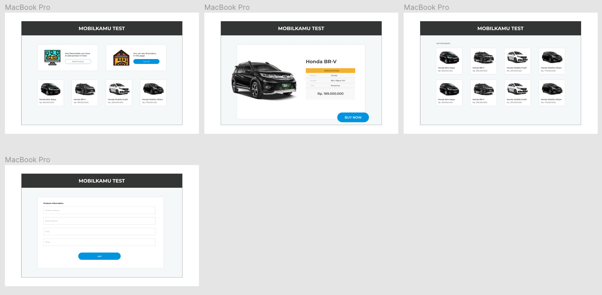

# mobilkamu-test

## Build Setup

``` bash
# install dependencies
$ npm run install

# serve with hot reload at localhost:3000
$ npm run dev

# build for production and launch server
$ npm run build
$ npm run start

# generate static project
$ npm run generate
```


```
    MOBILKAMU-TEST
```

Project untuk test ini menggunakan bahasa pemrograman javascript dengan library vue-js dan framwork nuxt-js, 

Flow wireframe:
Sebelum saya membuat code untuk project ini, saya membuat wireframe bisa dilihat dibawah



untuk hasil masih dalam pengembangan karena waktu test yang terbatas

Untuk mockup apiary :
# Mobilkamu Test

Ini merupakan mockup untuk test di Mobilkamu

## Profile
- no :
- product_name : 
- fuel :
- img_url :
- price :
## Products Collection [/product]

### List All Product [GET]

+ Response 200 (application/json)

        [
            {
                "id": 1,
                "product_name": "HONDA NEW BRV E",
                "brand_name":"Honda",
                "fuel":"Pertamax",
                "img_url":"https://s3-ap-southeast-1.amazonaws.com/mobilkamu-web/New_Mobilkamu_Car_Photos/Honda/Honda/Honda+BRV/Honda+BRV+Crystal+Black+Pearl.png",
                "price": 169000000
            },
            {
                "id": 2,
                "product_name": "HONDA MOBILIO Z",
                "brand_name":"Honda",
                "fuel":"Pertamax",
                "img_url":"https://s3-ap-southeast-1.amazonaws.com/mobilkamu-web/New_Mobilkamu_Car_Photos/Honda/Honda/Honda+Mobilio/Honda+Mobilio+Taffeta+White.png",
                "price": 159000000
            },
            {
                "id": 3,
                "product_name": "HONDA NEW JAZZ YELLOW",
                "brand_name":"Honda",
                "fuel":"Pertamax",
                "img_url":"https://s3-ap-southeast-1.amazonaws.com/mobilkamu-web/New_Mobilkamu_Car_Photos/Honda/Honda/Honda+Jazz/Honda+Jazz+Carnival+Yellow.png",
                "price": 269000000
            },
            {
                "id": 4,
                "product_name": "HONDA NEW JAZZ RED",
                "brand_name":"Honda",
                "fuel":"Pertamax",
                "img_url":"https://s3-ap-southeast-1.amazonaws.com/mobilkamu-web/New_Mobilkamu_Car_Photos/Honda/Honda/Honda+Jazz/Honda+Jazz+Rallye+Red.png",
                "price": 199000000
            }
        ]

### Create a New Product [POST]

Fitur ini digunakan untuk menambahkan product

+ Request (application/json)

        {
            "product_name": "HONDA NEW JAZZ RED",
            "brand_name":"Honda",
            "fuel":"Pertamax",
            "img_url":"https://s3-ap-southeast-1.amazonaws.com/mobilkamu-web/New_Mobilkamu_Car_Photos/Honda/Honda/Honda+Jazz/Honda+Jazz+Rallye+Red.png",
            "price": 199000000
        }

+ Response 201 (application/json)

    + Headers

            Location: /product/6

    + Body

            {
                "status": "success",
                "published_at": "2019-18-05T08:40:51.620Z",
            }

## Product [/product-detail/{id}]

+ Parameters
    + id (required, number, `1`) 

### Detail Product [GET]
+ Response 200 (application/json)

        {
                "product_name": "HONDA NEW BRV E",
                "brand_name":"Honda",
                "fuel":"Pertamax",
                "img_url":"https://s3-ap-southeast-1.amazonaws.com/mobilkamu-web/New_Mobilkamu_Car_Photos/Honda/Honda/Honda+BRV/Honda+BRV+Crystal+Black+Pearl.png",
                "price": 169000000
        }
    
      


``` 
Flow project : 
# install dependencies
$ npm run install

# serve with hot reload at localhost:3000
$ npm run dev

# build for production and launch server
$ npm run build
$ npm run start

# generate static project
$ npm run generate
```


Todo list for next :
 - Update helper for centralize state
 - Update form upload image
 - Update Comment
 - build heroku